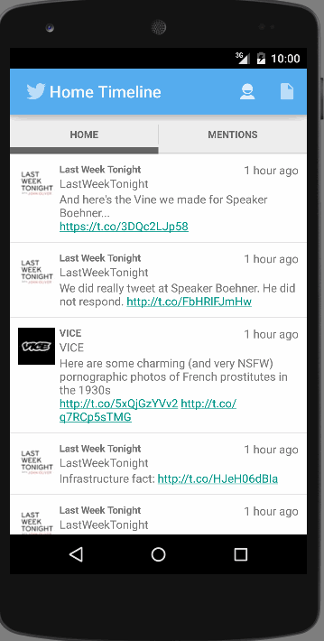
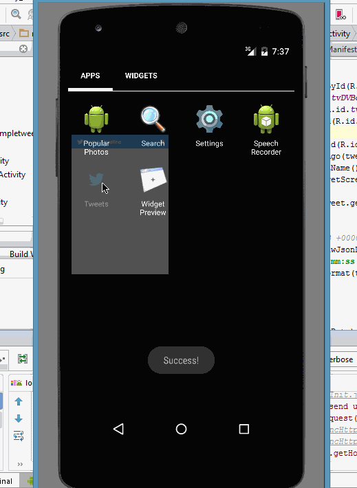

# Simple Twitter App

## Overview (Week 2 Updated) Twitter Redux
Improved the Initial Twitter app to include the following feature 
Required Stories
* Includes all required user stories from Week 3 Twitter Client
* User can switch between Timeline and Mention views using tabs.
* User can view their home timeline tweets.
* User can view the recent mentions of their username.
* User can navigate to view their own profile
* User can see picture, tagline, # of followers, # of following, and tweets on their profile.
* User can click on the profile image in any tweet to see another user's profile.
* User can see picture, tagline, # of followers, # of following, and tweets of clicked user.
* Profile view should include that user's timeline
Optional: 
* User can view following / followers list through the profile
* User can infinitely paginate any of these timelines (home, mentions, user) by scrolling to the bottom
* Robust error handling for network failures
* User can click on a tweet to be taken to a "detail view" of that tweet
* Improve the user experience to feel like Twitter branded
* User can go back to the HomeTimeline from anyother view Profile, Compose etc using the ActionBar back button

## Usage Walkthrough (Week 2 updated)
 

## Overview (Week 1)

Simple Twitter App uses Twitter API and OAuth JSON REST APIs to build a simple application with the following user stories:
Required Stories
 * User can sign in to Twitter using OAuth login
 * User can view the tweets from their home timeline
        ** User can see the username, name, and body for each tweet
        ** User can see  the relative timestamp for each tweet "8m", "7h"
        ** User can view more tweets as they scroll with infinite pagination
 * User can compose a new tweet
 * User can click a “Compose” icon in the Action Bar on the top right
        ** User can then enter a new tweet and post this to twitter
        ** User is taken back to home timeline with new tweet visible in timeline
Optional: 
 * User can see a counter with total number of characters left for tweet
 * Links in tweets are clickable and will launch the web browser
Advanced
 * User can refresh tweets timeline by pulling down to refresh
 * User can tap a tweet to display a "detailed" view of that tweet
 * User can select "reply" from detail view to respond to a tweet
 * User interface and theme of the app to feel "twitter branded"
 

The following libraries are used to make this possible:

 * [scribe-java](https://github.com/fernandezpablo85/scribe-java) - Simple OAuth library for handling the authentication flow.
 * [Android Async HTTP](https://github.com/loopj/android-async-http) - Simple asynchronous HTTP requests with JSON parsing
 * [codepath-oauth](https://github.com/thecodepath/android-oauth-handler) - Custom-built library for managing OAuth authentication and signing of requests
 * [Picasso](https://github.com/square/picasso) - Used for async image loading and caching them in memory and on disk.
 * [ActiveAndroid](https://github.com/pardom/ActiveAndroid) - Simple ORM for persisting a local SQLite database on the Android device

## Usage Walkthrough

